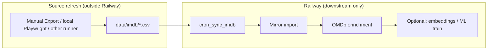

# IMDb export → TasteGraph sync

TasteGraph ingests **CSV exports** from IMDb. The supported model splits **source refresh** (get new CSVs) from **downstream sync** (mirror into Postgres, enrich metadata, optional embeddings/ML).

## Architecture (supported production model)



| Role | Where | What runs |
|------|--------|-----------|
| **Source refresh** | Your laptop, CI, or any machine with browser/login | Manual IMDb **Export**, or [local Playwright](imdb-playwright-local-only.md), then copy CSVs or push via `sync_remote.sh` / admin import |
| **Downstream sync** | **Railway** (or any host with the app DB) | `cron_sync_imdb` → mirror import → bounded OMDb enrichment; optionally `--embeddings` / `--train-ml` on a rare schedule |

**Railway does not refresh IMDb source files.** It only consumes CSVs that already exist (volume, upload, or remote import). Public HTTP scrape (`refresh_imdb_public_scrape`) is **experimental** — see [Experimental: public scrape](#experimental-public-scrape-best-effort-only); do not rely on it in production (IMDb often returns `202` with empty bodies).

### Recommended commands

**1. Local / external — refresh source CSVs**

```bash
cd backend

# Option A: manual — download from IMDb Export UI, copy into ../data/imdb/ with standard names

# Option B: automated on your machine (Playwright + saved session)
pip install -r requirements-imdb-browser.txt && playwright install chromium
python -m app.scripts.imdb_playwright_save_storage -o ../data/imdb/.playwright_storage_state.json
python -m app.scripts.refresh_imdb_exports
```

Then push data to production if needed (from repo root):

```bash
./scripts/sync_remote.sh          # or --parity when you want full mirror parity
```

**2. Railway — sync and enrich only**

Scheduled job on the backend service (no Playwright, no scrape refresh):

```bash
cd /path/to/tastegraph/backend && /path/to/venv/bin/python -m app.scripts.cron_sync_imdb
```

Weekly metadata backlog without new CSVs:

```bash
python -m app.scripts.cron_sync_imdb --enrich-if-unchanged --enrich-limit 25
```

**3. Local — same downstream path as Railway** (when CSVs are already in `data/imdb/`):

```bash
cd backend && python -m app.scripts.cron_sync_imdb
```

## What to download on IMDb

| TasteGraph table | IMDb source | Typical export |
|------------------|-------------|----------------|
| **Ratings** | Your ratings | Ratings page → menu → **Export** → CSV |
| **Watchlist** | Watchlist | Watchlist → menu → **Export** → CSV |
| **Favorite list** (curated titles) | A **list** you maintain (e.g. public list URL) | Open the list → **Export** → CSV |
| **Favorite people** | Favorite people | That page → **Export** → CSV (or a simple `name,role` file you maintain) |

Exports usually include a header row with columns such as **Const** (title id `tt…`), **Position**, **Title**, **Your Rating**, **Date Rated**, etc. Formats are detected automatically where multiple layouts exist (e.g. ratings “rich” vs minimal export).

## Semantics

| Import | Default CLI / old behavior | **Sync** scripts / `mirror=true` |
|--------|----------------------------|----------------------------------|
| **Ratings** | Insert-only, or upsert with `--upsert` | **Mirror**: upsert from file + **delete** ratings not in CSV |
| **Watchlist** | Upsert only (no deletes) | **Mirror**: upsert + **delete** rows not in CSV |
| **Favorite list** | Always **mirror** | Same |
| **Favorite people** | Always **mirror** | Same |

**Mirror** = the database table for that source is meant to **match the export file** after the run.

## One-shot commands (from `backend/`)

Point each `--csv` at the file you just downloaded (rename/move as you like).

```bash
cd backend

python -m app.scripts.sync_imdb_ratings --csv /path/to/ratings.csv
python -m app.scripts.sync_imdb_watchlist --csv /path/to/watchlist.csv
python -m app.scripts.sync_imdb_favorite_list --csv /path/to/your_list_export.csv
python -m app.scripts.sync_imdb_favorite_people --csv /path/to/favorite_people.csv
```

## Batch: standard filenames in one folder

If you copy exports into a single directory using these names:

- `ratings.csv`
- `watchlist.csv`
- `favorite_list.csv`
- `favorite_people.csv`

(default layout: repo `data/imdb/` next to `backend/`)

```bash
cd backend
python -m app.scripts.sync_imdb_exports --data-dir ../data/imdb
```

Override individual files:

```bash
python -m app.scripts.sync_imdb_exports \
  --data-dir ../data/imdb \
  --favorite-list ~/Downloads/ls021795057.csv
```

Missing files are **skipped** (no error).

## Lower-level modules (same importers)

```bash
python -m app.imports.ratings /path/to/ratings.csv --upsert
python -m app.imports.ratings /path/to/ratings.csv --mirror

python -m app.imports.watchlist /path/to/watchlist.csv
python -m app.imports.watchlist /path/to/watchlist.csv --mirror
```

Default-path wrappers (optional `--mirror` / `--upsert`):

```bash
python -m app.scripts.import_ratings_default
python -m app.scripts.import_ratings_default --mirror
python -m app.scripts.import_watchlist_default --mirror
```

## Admin HTTP API (optional)

With `X-Admin-Import-Token`:

- `POST /admin/import/ratings?upsert=true&mirror=true`
- `POST /admin/import/watchlist?mirror=true`

Responses include `deleted` when mirror removes rows.

## Notes

- **Empty CSV + mirror** on ratings or watchlist will **clear** that table—use only with a deliberate full export.
- Favorite people **IMDb export** format is detected from columns (e.g. Name + Description / Known For); role is **inferred** (actor / director / writer). A simple CSV `name,role` is also supported.
- Automated download via cookies/URLs is fragile; prefer manual export. See `sync_imdb_favorite_list.py` docstring for an optional `curl` sketch.

## Cron: sync only when exports change

`cron_sync_imdb` stores a **SHA-256 per CSV** under `backend/data/sync/imdb_cron_state.json` (by default). On each run:

| Step | When it runs |
|------|----------------|
| Hash each present file in `--data-dir` | **Every run** |
| Compare to state | **Every run** |
| Mirror **import** for a source | Only if that file’s hash **changed** (or first run) |
| **OMDb enrichment** (bounded batch) | If any import ran this run, or if `--enrich-if-unchanged` |
| **Embeddings** (`generate_title_embeddings`) | Only if `--embeddings` **and** at least one import ran |
| **ML training** (`train_8plus_baseline`) | Only if `--train-ml` (heavy; use a separate rare schedule) |

If **no** CSV changed and you did not pass `--enrich-if-unchanged`, the script exits quickly after updating state for **missing** files (drops stale hash keys).

### Recommended schedules

1. **Source refresh (external, e.g. daily/weekly):** refresh CSVs on your machine (manual Export or `refresh_imdb_exports`), then `sync_remote.sh` or upload to wherever Railway reads `data/imdb/` — **not** on the Railway cron itself.

2. **Railway (e.g. hourly):** downstream only — `cron_sync_imdb` when CSVs on the service have changed (or after remote import updated the DB via admin API).

3. **Railway (weekly):** drain metadata backlog without new CSVs:

   ```bash
   python -m app.scripts.cron_sync_imdb --enrich-if-unchanged --enrich-limit 25
   ```

4. **Rarely:** after meaningful library changes, optionally add `--embeddings` to a job that already saw imports, or run `generate_title_embeddings` manually. Run `train_8plus_baseline` on its own cadence (e.g. monthly), not every import.

### Flags (see `--help`)

- `--dry-run` — print what would happen; no DB or state writes  
- `--skip-enrich` — imports only (not recommended for normal cron)  
- `--enrich-limit N` — cap OMDb calls per run (default 30)  
- `--embeddings` — subprocess embedding rebuild **only when imports ran**  
- `--train-ml` — subprocess ML train (optional; slow)

### Failure behavior

- If an **import** raises, the script exits **1** after logging; hashes for sources **not** yet updated this run stay old so the next cron **retries** the same file. Successfully imported sources already have new hashes saved.

### Operational assumption

`cron_sync_imdb` only reads **existing** CSVs and updates the DB when hashes change. **Refreshing those CSVs is an external step** (manual Export, local Playwright — see [imdb-playwright-local-only.md](imdb-playwright-local-only.md), or `sync_remote.sh` from a machine that has fresh data). **Railway cron = downstream sync/enrich only.**

---

## Experimental: public scrape (best-effort only)

**Not the supported production path.** `refresh_imdb_public_scrape` fetches public IMDb URLs with HTTP and writes the same filenames under `data/imdb/`. In practice IMDb often **blocks automated requests** (`202 Accepted` with **0-byte** bodies from datacenter IPs), so this usually **fails validation** and **does not overwrite** CSVs — which is intentional fail-safe behavior, not a reliable refresh mechanism.

Kept for experimentation and possible future use; **do not schedule this on Railway** as your primary source refresh.

### Why it usually fails

- **Client-rendered** pages and **anti-bot** responses (empty shells, no `tt…` ids).
- Layout and embedded JSON change without notice; extraction is **heuristic**.
- **Ratings** are only written if a **numeric 1–10 rating** is parsed for **every** title; otherwise `ratings.csv` is skipped so mirror sync cannot wipe scores.

### Environment

| Output file | Variable |
|-------------|----------|
| `favorite_list.csv` | `IMDB_SCRAPE_LIST_URL` |
| `watchlist.csv` | `IMDB_SCRAPE_WATCHLIST_URL` |
| `ratings.csv` | `IMDB_SCRAPE_RATINGS_URL` |
| `favorite_people.csv` | `IMDB_SCRAPE_FAVORITE_PEOPLE_URL` |

Optional guards: `IMDB_SCRAPE_MIN_FAVORITE_LIST`, `IMDB_SCRAPE_MIN_WATCHLIST`, `IMDB_SCRAPE_MIN_RATINGS`, `IMDB_SCRAPE_MIN_FAVORITE_PEOPLE` (absolute minimum row counts); `IMDB_SCRAPE_MIN_DROP_RATIO` (default `0.5`); `IMDB_SCRAPE_PREV_MIN_FOR_RATIO`; `IMDB_SCRAPE_USER_AGENT`.

Last accepted counts are stored in `data/imdb/.scrape_refresh_state.json` (gitignored).

### Safety behavior

- **Too few rows** vs configured minimum → error, **no** write for that source.
- **Large drop** vs last accepted count (ratio guard) → error, **no** write.
- **Tiny or empty HTTP body** → error, **no** write.
- Successful writes use a temp `*.csv.part` file and **atomic replace** of the target CSV.
- Failed sources leave the **previous** CSV on disk, so the next `cron_sync_imdb` sees an **unchanged hash** and does **not** mirror-clear that table.

If you try it locally (not recommended for production):

```bash
cd backend && python -m app.scripts.refresh_imdb_public_scrape
# then, only if scrape succeeded:
python -m app.scripts.cron_sync_imdb
```

---

## Local source refresh: Playwright + Export button

**Recommended automated refresh outside Railway.** The backend ships without Playwright; production images install **`requirements.txt` only**.

To drive IMDb’s logged-in **Export** flow on your **own computer**, install the optional browser stack and follow [imdb-playwright-local-only.md](imdb-playwright-local-only.md). Then run `cron_sync_imdb` locally or push data to Railway via `sync_remote.sh` / admin import.
